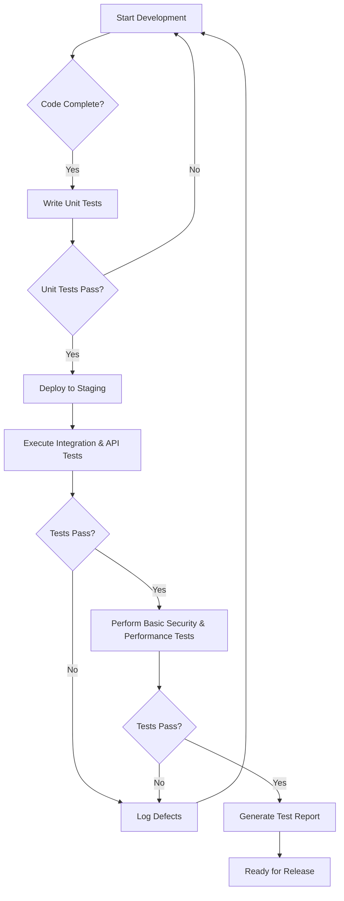

# Test Strategy Document - Feature Request Tracker Backend

## 1. Introduction & Objectives
This document outlines the test strategy for the backend of the Feature Request Tracker, as detailed in the Technical Requirements Document (TRD) - Backend. The primary objective is to ensure the quality, reliability, and performance of the backend services, which are developed using Node.js, Express, and Prisma with an SQLite database.

The key objectives of this test strategy are:
*   To verify that all API endpoints function correctly according to the defined input and output schemas.
*   To ensure data integrity and consistency within the SQLite database via Prisma ORM.
*   To validate the security measures implemented, including CORS, rate limiting, and Helmet.js.
*   To confirm the robustness of the error handling mechanisms.
*   To ensure the backend can handle expected load and respond within acceptable performance thresholds.

## 2. Scope
The scope of this test strategy covers the backend services of the Feature Request Tracker MVP.

**In-Scope:**
*   **API Endpoints:** All public API endpoints (`POST /feature-requests`, `PUT /feature-requests/:id/status`, `GET /feature-requests`, `GET /feature-requests/:id`, `DELETE /feature-requests/:id`) and their respective request/response schemas.
*   **Database Interactions:** CRUD operations on the `FeatureRequest` model using Prisma ORM.
*   **Business Logic:** Validation of priority and status enums, default values, and timestamp management.
*   **Security:** CORS configuration, rate limiting, and HTTP header security (Helmet.js).
*   **Error Handling:** Centralized error middleware and consistent error response structures for operational and programming errors.
*   **Configuration:** Environment variable loading and application startup.

**Out-of-Scope:**
*   Frontend application testing.
*   Infrastructure and deployment testing (e.g., containerization, CI/CD pipeline setup beyond integration testing).
*   Performance testing beyond basic load scenarios for MVP.
*   Security penetration testing (will be covered in a separate security audit).

## 3. Testing Types & Levels

### Unit Testing
*   **Focus:** Individual functions, modules, and components (e.g., controllers, services, utility functions, Prisma client interactions).
*   **Tools:** Jest, Supertest (for isolated API handler testing).
*   **Coverage:** Aim for high code coverage (e.g., >80%) for critical business logic and utility functions.

### Integration Testing
*   **Focus:** Interactions between different modules, database integration, and external services (if any).
*   **Tools:** Supertest (for end-to-end API calls), Jest.
*   **Scope:** Verify that API endpoints correctly interact with the Prisma ORM and SQLite database, and that middleware functions are applied correctly.

### API Testing (End-to-End)
*   **Focus:** Verifying the complete flow of API requests from client to server and back, including data persistence.
*   **Tools:** Postman, Newman (for automated collection runs), or custom scripts using `axios`/`fetch`.
*   **Scope:** Validate all defined API endpoints, including various valid and invalid input scenarios, edge cases, and error responses.

### Security Testing (Basic)
*   **Focus:** Verification of implemented security middlewares.
*   **Scope:** Test CORS headers, rate limiting functionality, and presence of Helmet.js-related HTTP headers.

## 4. Test Approach

1.  **Test Planning:** Develop detailed test plans for each testing type, including test cases, data, and expected results.
2.  **Test Case Design:**
    *   **Positive Testing:** Verify expected behavior with valid inputs.
    *   **Negative Testing:** Verify error handling with invalid inputs, missing parameters, and unauthorized access attempts.
    *   **Boundary Value Analysis:** Test at the limits of input ranges.
    *   **Equivalence Partitioning:** Group inputs into classes that are expected to behave similarly.
3.  **Test Environment Setup:** Configure dedicated test environments (local, staging) with appropriate database instances.
4.  **Test Execution:** Execute test cases manually and automatically.
5.  **Defect Management:** Log, track, and retest defects using a chosen defect tracking system.
6.  **Regression Testing:** Automate critical test cases to ensure new changes do not introduce regressions.

## 5. Environments & Tools

*   **Development Environment:** Local machines for unit and initial integration testing.
*   **Staging Environment:** A dedicated environment mirroring production for comprehensive integration and API testing.
*   **Database:** SQLite for development and testing.
*   **Version Control:** Git/GitHub.
*   **Test Frameworks:** Jest (unit/integration), Supertest (API integration).
*   **API Testing Tools:** Postman.
*   **Documentation:** Swagger UI for API exploration.

## 6. Roles & Responsibilities

*   **Developers:** Responsible for writing unit tests, initial integration tests, and fixing defects.
*   **QA Engineers:** Responsible for designing and executing integration, API, and basic performance/security tests, defect reporting, and regression testing.
*   **Product Owner:** Responsible for reviewing test plans and approving test results.

## 7. Entry/Exit Criteria

### Entry Criteria
*   TRD - Backend document is approved.
*   All development tasks for a feature are completed and code is committed.
*   Unit tests for the feature are written and passing.
*   Test environment is set up and stable.

### Exit Criteria
*   All critical and high-priority test cases are executed and passed.
*   No critical or high-priority open defects.
*   Test coverage targets are met (for unit tests).
*   Performance benchmarks (if applicable) are met.
*   All identified defects are logged and tracked.
*   Test summary report is generated and approved.

## 8. Risks & Mitigation

| Risk                                  | Mitigation Strategy                                                                                             |
| :------------------------------------ | :-------------------------------------------------------------------------------------------------------------- |
| Incomplete requirements               | Regular communication with product owner, detailed TRD, and clear acceptance criteria.                          |
| Insufficient test data                | Develop comprehensive test data generation scripts and maintain a robust test data management strategy.         |
| Environment instability               | Use containerized environments (Docker) for consistency, regular environment health checks.                     |
| Time constraints                      | Prioritize critical test cases, automate repetitive tasks, and allocate sufficient time for testing in sprints. |
| Lack of automation expertise           | Provide training for QA engineers, leverage existing frameworks and tools.                                      |
| Regression bugs                       | Implement a strong suite of automated regression tests, run on every code commit.                               |

## 9. Reporting & Metrics

*   **Test Summary Report:** Generated at the end of each testing cycle, including:
    *   Total test cases, passed, failed, skipped.
    *   Defect count by severity and status.
    *   Test coverage metrics (unit tests).
    *   Overall quality assessment.
*   **Defect Density:** Number of defects per unit of code.
*   **Test Execution Progress:** Track daily/weekly progress of test case execution.
*   **Automation Coverage:** Percentage of test cases automated.

## Workflow Diagram (Mermaid)

