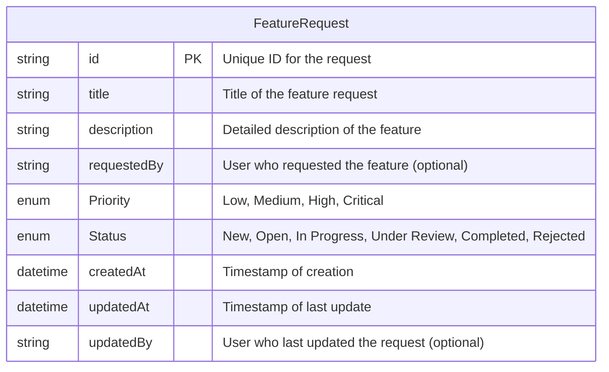

# Technical Requirements Document (TRD) - Backend

## 1. Introduction
This document outlines the high-level technical design for the backend of the Feature Request Tracker, focusing on the Minimum Viable Product (MVP) features as defined in the PRD. The backend will be developed using Node.js, Express, and Prisma with an SQLite database.

## 2. Architecture Overview
*   **Technology Stack:** Node.js, Express.js, Prisma ORM, SQLite.
*   **Deployment Environment:** (To be defined later, but consider containerization for future scalability).
*   **API Style:** RESTful API.

## 3. Database Schema (ER Diagram)

Based on the MVP features, the core entity will be `FeatureRequest`.



## 4. API Scaffolding and Configuration

*   **Node.js & Express Setup:**
    *   Basic Express application structure.
    *   `package.json` with necessary dependencies (express, prisma, sqlite, cors, dotenv, swagger-ui-express, swagger-jsdoc).
*   **CORS Configuration:**
    *   Enable CORS for all origins during development, restrict to specific frontend origins in production.
    *   Middleware to handle CORS headers.
*   **Security Middlewares:**
    *   Basic rate limiting to prevent abuse.
    *   Helmet.js for setting various HTTP headers to improve security (e.g., X-XSS-Protection, Strict-Transport-Security).
    *   Input validation (e.g., using `express-validator` or similar) for all incoming API requests.
*   **Swagger Setup:**
    *   Integrate `swagger-ui-express` and `swagger-jsdoc` for API documentation.
    *   Swagger definition to describe API endpoints, models, and security schemes.

## 5. Prisma DB Setup

*   **Database:** SQLite for simplicity in MVP.
*   **Prisma Schema (`schema.prisma`):**
    ```prisma
    // schema.prisma
    generator client {
      provider = "prisma-client-js"
    }

    datasource db {
      provider = "sqlite"
      url      = env("DATABASE_URL")
    }

    enum Priority {
      Low
      Medium
      High
      Critical
    }

    enum Status {
      New
      Open
      InProgress
      UnderReview
      Completed
      Rejected
    }

    model FeatureRequest {
      id          String   @id @default(cuid())
      title       String
      description String
      requestedBy String?
      priority    Priority @default(Medium)
      status      Status   @default(New)
      createdAt   DateTime @default(now())
      updatedAt   DateTime @updatedAt
      updatedBy   String?
    }
    ```
*   **Migrations:** Use Prisma Migrate for schema evolution.

## 6. API Endpoints (Public) with Input and Output Schema

All endpoints will be prefixed with `/api/v1`.

*   **`POST /feature-requests` - Add New Feature Request**
    *   **Description:** Submits a new feature request.
    *   **Input Schema (Request Body):**
        ```json
        {
            "title": "string",        // Required
            "description": "string",  // Required
            "requestedBy": "string",  // Optional
            "priority": "enum"        // Optional, default: "Medium" (Low, Medium, High, Critical)
        }
        ```
    *   **Output Schema (Success - 201 Created):**
        ```json
        {
            "id": "string",
            "title": "string",
            "description": "string",
            "requestedBy": "string",
            "priority": "enum",
            "status": "enum",
            "createdAt": "datetime",
            "updatedAt": "datetime",
            "updatedBy": "string"
        }
        ```
    *   **Output Schema (Error - 400 Bad Request):**
        ```json
        {
            "message": "string",
            "errors": [
                {"field": "string", "message": "string"}
            ]
        }
        ```

*   **`PUT /feature-requests/:id/status` - Update Request Status**
    *   **Description:** Updates the status of an existing feature request.
    *   **Input Schema (Request Body):**
        ```json
        {
            "status": "enum" // Required (New, Open, In Progress, Under Review, Completed, Rejected)
        }
        ```
    *   **Output Schema (Success - 200 OK):**
        ```json
        {
            "id": "string",
            "title": "string",
            "description": "string",
            "requestedBy": "string",
            "priority": "enum",
            "status": "enum",
            "createdAt": "datetime",
            "updatedAt": "datetime",
            "updatedBy": "string"
        }
        ```
    *   **Output Schema (Error - 400 Bad Request, 404 Not Found):**
        ```json
        {
            "message": "string"
        }
        ```

*   **`GET /feature-requests` - View All Requests**
    *   **Description:** Retrieves a list of all feature requests. Supports sorting and filtering.
    *   **Input Schema (Query Parameters):**
        *   `sortBy`: "title" | "status" | "priority" | "createdAt" (default: "createdAt")
        *   `sortOrder`: "asc" | "desc" (default: "desc")
        *   `status`: "New" | "Open" | "In Progress" | "Under Review" | "Completed" | "Rejected" (optional)
        *   `priority`: "Low" | "Medium" | "High" | "Critical" (optional)
        *   `page`: "number" (default: 1)
        *   `limit`: "number" (default: 10, max: 100)
    *   **Output Schema (Success - 200 OK):**
        ```json
        {
            "data": [
                {
                    "id": "string",
                    "title": "string",
                    "description": "string",
                    "requestedBy": "string",
                    "priority": "enum",
                    "status": "enum",
                    "createdAt": "datetime",
                    "updatedAt": "datetime",
                    "updatedBy": "string"
                }
            ],
            "pagination": {
                "totalItems": "number",
                "currentPage": "number",
                "totalPages": "number",
                "itemsPerPage": "number"
            }
        }
        ```
    *   **Output Schema (Error - 400 Bad Request):**
        ```json
        {
            "message": "string"
        }
        ```

*   **`GET /feature-requests/:id` - View Single Request**
    *   **Description:** Retrieves details of a specific feature request.
    *   **Output Schema (Success - 200 OK):**
        ```json
        {
            "id": "string",
            "title": "string",
            "description": "string",
            "requestedBy": "string",
            "priority": "enum",
            "status": "enum",
            "createdAt": "datetime",
            "updatedAt": "datetime",
            "updatedBy": "string"
        }
        ```
    *   **Output Schema (Error - 404 Not Found):**
        ```json
        {
            "message": "string"
        }
        ```

*   **`DELETE /feature-requests/:id` - Delete Request**
    *   **Description:** Deletes a feature request.
    *   **Output Schema (Success - 204 No Content):**
        *   No content returned.
    *   **Output Schema (Error - 404 Not Found):**
        ```json
        {
            "message": "string"
        }
        ```

## 7. Error Handling in Express

*   **Centralized Error Middleware:**
    *   A dedicated Express error handling middleware will catch all errors.
    *   This middleware will format error responses consistently.
*   **Error Types:**
    *   **Operational Errors:** Expected errors (e.g., invalid input, resource not found). These will be handled gracefully and return appropriate HTTP status codes (4xx).
    *   **Programming Errors:** Unexpected errors (e.g., bugs in code). These will result in a generic 500 Internal Server Error in production, with detailed logs for debugging.
*   **Error Response Structure:**
    ```json
    {
        "status": "error",
        "message": "string",
        "statusCode": "number",
        "details": "object" // Optional, for validation errors or specific context
    }
    ```
