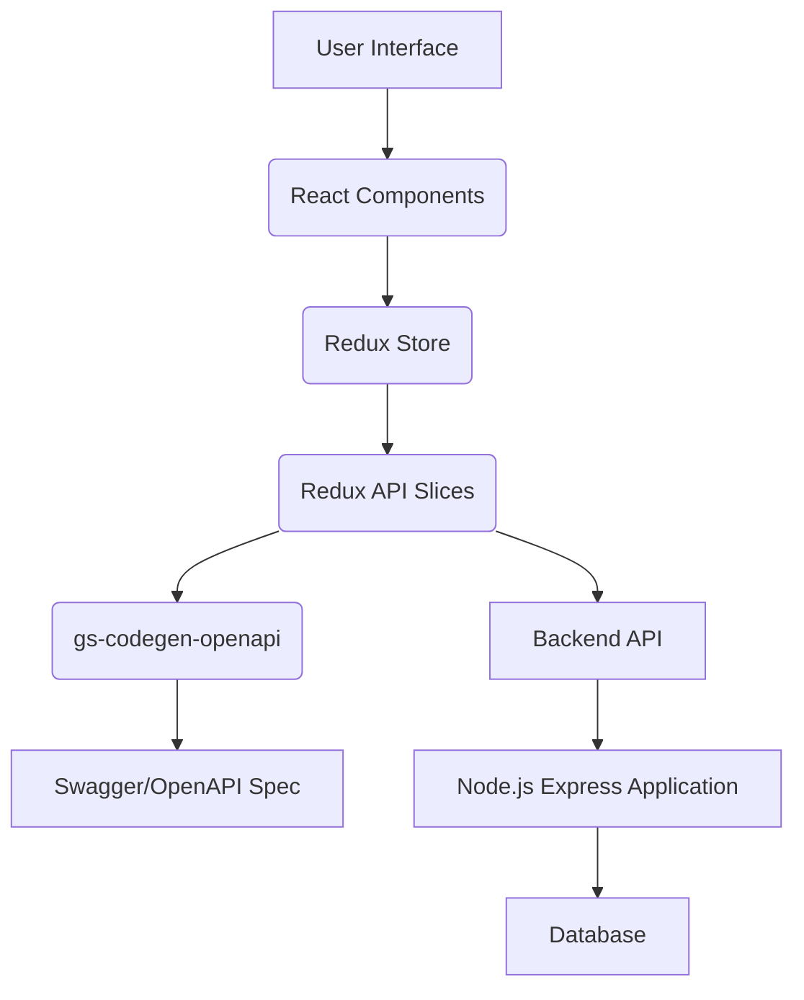

## Frontend Technical Requirements Document (TRD): Feature Request Tracker

### 1. Introduction
This document outlines the high-level technical requirements for the frontend of the Feature Request Tracker application. The frontend will be responsible for providing a user interface to interact with the backend API, enabling users to manage feature requests as defined in the Product Requirements Document (PRD).

### 2. Architecture Overview

The frontend will be built using a modern JavaScript framework (e.g., React, Vue, Angular - *to be decided, assuming React for Redux examples*) and will leverage Redux Toolkit for state management. Initial project scaffolding will be generated using `gs-ui-init`. API interaction will be streamlined using Redux API Slices generated by `gs-codegen-openapi`.



### 3. Core Technical Requirements

#### 3.1. Redux API Slices with `gs-codegen-openapi`

**Objective:** Automatically generate Redux API slices and API endpoints from the `swagger.json` specification to ensure type safety, reduce boilerplate, and maintain consistency in API interactions.

**Details:**
*   **Tooling:** The `gs-codegen-openapi` tool will be used to process the `docs/swagger.json` file.
*   **Output:** This tool will generate a Redux Toolkit Query (RTK Query) API slice, including:
    *   Base API configuration.
    *   Endpoint definitions for all paths specified in `swagger.json` (e.g., `getFeatureRequests`, `createFeatureRequest`, `getFeatureRequestById`, `deleteFeatureRequest`, `updateFeatureRequestStatus`).
    *   Type definitions for request bodies, response data, and query parameters based on the OpenAPI schemas.
*   **Benefits:**
    *   **Type Safety:** Ensures that API requests and responses adhere to the defined schemas, catching errors at compile time.
    *   **Reduced Boilerplate:** Eliminates the need to manually write Redux actions, reducers, and thunks for API calls.
    *   **Caching & Deduplication:** RTK Query automatically handles caching, request deduplication, and re-fetching, improving performance and developer experience.
    *   **Consistency:** Enforces a consistent pattern for API interaction across the application.

**Example Generated Slice Structure (Conceptual):**

```typescript
// src/services/featureRequestsApi.ts (generated)
import { createApi, fetchBaseQuery } from '@reduxjs/toolkit/query/react';
import type { FeatureRequest, CreateFeatureRequestDto, UpdateFeatureRequestStatusDto, PaginationResponse } from './types'; // Generated types

export const featureRequestsApi = createApi({
  reducerPath: 'featureRequestsApi',
  baseQuery: fetchBaseQuery({ baseUrl: 'http://localhost:3000/api/v1' }),
  endpoints: (builder) => ({
    getFeatureRequests: builder.query<PaginationResponse<FeatureRequest>, { sortBy?: string; sortOrder?: string; status?: string; priority?: string; page?: number; limit?: number }>({
      query: (params) => ({ url: '/feature-requests', params }),
    }),
    createFeatureRequest: builder.mutation<FeatureRequest, CreateFeatureRequestDto>({
      query: (body) => ({
        url: '/feature-requests',
        method: 'POST',
        body,
      }),
    }),
    getFeatureRequestById: builder.query<FeatureRequest, string>({
      query: (id) => `/feature-requests/${id}`,
    }),
    deleteFeatureRequest: builder.mutation<void, string>({
      query: (id) => ({
        url: `/feature-requests/${id}`,
        method: 'DELETE',
      }),
    }),
    updateFeatureRequestStatus: builder.mutation<FeatureRequest, { id: string; status: UpdateFeatureRequestStatusDto }>({
      query: ({ id, status }) => ({
        url: `/feature-requests/${id}/status`,
        method: 'PUT',
        body: status,
      }),
    }),
  }),
});

export const {
  useGetFeatureRequestsQuery,
  useCreateFeatureRequestMutation,
  useGetFeatureRequestByIdQuery,
  useDeleteFeatureRequestMutation,
  useUpdateFeatureRequestStatusMutation,
} = featureRequestsApi;
```

#### 3.2. Redux Providers and Store Setup

**Objective:** Configure the Redux store and integrate the generated API slices, making the API endpoints and global state accessible throughout the application.

**Details:**
*   **Store Configuration:** A central Redux store will be created using `configureStore` from Redux Toolkit.
*   **API Slice Integration:** The generated `featureRequestsApi` reducer and middleware will be added to the Redux store.
*   **Provider Setup:** The Redux store will be provided to the React application using the `<Provider>` component from `react-redux` at the root level.

**Example Store Setup:**

```typescript
// src/app/store.ts
import { configureStore } from '@reduxjs/toolkit';
import { setupListeners } from '@reduxjs/toolkit/query';
import { featureRequestsApi } from '../services/featureRequestsApi'; // Generated API slice

export const store = configureStore({
  reducer: {
    [featureRequestsApi.reducerPath]: featureRequestsApi.reducer,
    // Add other reducers here if needed for local UI state
  },
  middleware: (getDefaultMiddleware) =>
    getDefaultMiddleware().concat(featureRequestsApi.middleware),
});

setupListeners(store.dispatch);

export type RootState = ReturnType<typeof store.getState>;
export type AppDispatch = typeof store.dispatch;
```

**Example Provider Setup:**

```typescript
// src/index.tsx (or App.tsx)
import React from 'react';
import ReactDOM from 'react-dom/client';
import { Provider } from 'react-redux';
import { store } from './app/store';
import App from './App';

const root = ReactDOM.createRoot(
  document.getElementById('root') as HTMLElement
);
root.render(
  <React.StrictMode>
    <Provider store={store}>
      <App />
    </Provider>
  </React.StrictMode>
);
```

#### 3.3. Usage of API Endpoints in Relevant Components

**Objective:** Integrate the generated API hooks into React components to fetch, create, update, and delete feature requests, adhering to the PRD's MVP features.

**Details:**
*   **View All Requests Component:**
    *   Will use `useGetFeatureRequestsQuery` to fetch a list of feature requests.
    *   Will implement UI for sorting and filtering based on query parameters (`sortBy`, `sortOrder`, `status`, `priority`).
    *   Will handle pagination using `page` and `limit` parameters.
    *   Each item in the list will link to a detailed view.
*   **Add New Feature Request Component:**
    *   Will use `useCreateFeatureRequestMutation` to submit new feature requests.
    *   Will include a form with fields for `title`, `description`, `requestedBy`, `priority`, and `status`.
    *   Will handle form submission and display success/error messages.
*   **Feature Request Detail/Update Status Component:**
    *   Will use `useGetFeatureRequestByIdQuery` to fetch details of a specific feature request.
    *   Will use `useUpdateFeatureRequestStatusMutation` to update the status of a feature request.
    *   Will include a UI element (e.g., dropdown) to change the status.
*   **Delete Request Component:**
    *   Will use `useDeleteFeatureRequestMutation` to delete a feature request.
    *   Will include a confirmation dialog before deletion.
    *   This component will likely be restricted to users with administrative permissions (authentication/authorization to be handled separately, but the API call will be available).

**Example Component Usage (Conceptual):**

```typescript
// src/components/FeatureRequestList.tsx
import React from 'react';
import { useGetFeatureRequestsQuery } from '../services/featureRequestsApi';

function FeatureRequestList() {
  const { data, error, isLoading } = useGetFeatureRequestsQuery({
    page: 1,
    limit: 10,
    sortBy: 'createdAt',
    sortOrder: 'desc',
  });

  if (isLoading) return <div>Loading feature requests...</div>;
  if (error) return <div>Error: {error.message}</div>;

  return (
    <div>
      <h1>Feature Requests</h1>
      <ul>
        {data?.data.map((request) => (
          <li key={request.id}>
            <h3>{request.title}</h3>
            <p>Status: {request.status}</p>
            <p>Priority: {request.priority}</p>
          </li>
        ))}
      </ul>
      {/* Pagination controls */}
    </div>
  );
}

export default FeatureRequestList;
```

```typescript
// src/components/CreateFeatureRequestForm.tsx
import React, { useState } from 'react';
import { useCreateFeatureRequestMutation } from '../services/featureRequestsApi';

function CreateFeatureRequestForm() {
  const [title, setTitle] = useState('');
  const [description, setDescription] = useState('');
  const [createRequest, { isLoading, isSuccess, isError, error }] = useCreateFeatureRequestMutation();

  const handleSubmit = async (e: React.FormEvent) => {
    e.preventDefault();
    await createRequest({ title, description, priority: 'Medium', status: 'New' });
  };

  return (
    <form onSubmit={handleSubmit}>
      <input type="text" value={title} onChange={(e) => setTitle(e.target.value)} placeholder="Title" required />
      <textarea value={description} onChange={(e) => setDescription(e.target.value)} placeholder="Description" required />
      <button type="submit" disabled={isLoading}>
        {isLoading ? 'Submitting...' : 'Create Feature Request'}
      </button>
      {isSuccess && <p>Feature request created successfully!</p>}
      {isError && <p>Error: {error?.message}</p>}
    </form>
  );
}

export default CreateFeatureRequestForm;
```

### 4. Next Steps

1.  **Frontend Framework Selection:** Confirm the specific frontend framework (e.g., React, Vue) to be used.
2.  **Initial Scaffolding:** Generate the initial project structure and basic UI components using the `gs-ui-init` Godspeed tool. This will provide a foundational setup for the frontend application.
3.  **Project Setup:** Install necessary dependencies (Redux Toolkit, React-Redux, etc.) after the initial scaffolding.
4.  **`gs-codegen-openapi` Integration:** Set up the `gs-codegen-openapi` tool to generate the API slices. This might involve adding a script to `package.json` to run the codegen command.
4.  **Component Development:** Develop the core UI components for listing, creating, viewing, and managing feature requests, integrating the generated API hooks.
5.  **Routing:** Implement client-side routing to navigate between different views (e.g., `/feature-requests`, `/feature-requests/new`, `/feature-requests/:id`).
6.  **Styling:** Define a styling strategy (e.g., Tailwind CSS, Styled Components, CSS Modules).